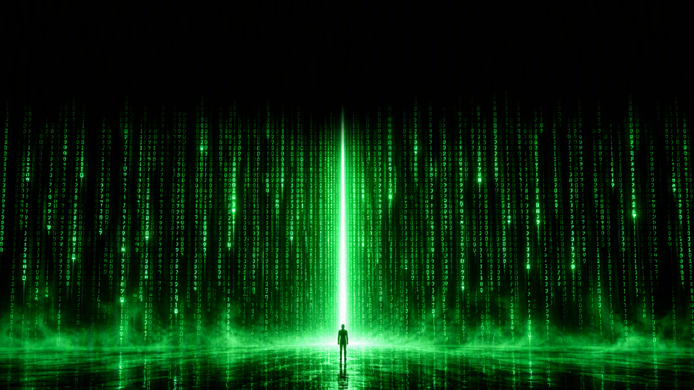

# Homebrew

An Omarchy 4 (Quattro) desktop port of luvus's **homebrew** theme: laser-lime
CRT phosphor on near-black. The palette is the authoritative set from luvus
`src/ui/theme.rs::homebrew()` — the same values jcode mirrors in
`~/.jcode/config.toml [display.colors]` — so luvus, jcode, the terminal, the
bar, and the wallpaper finally speak one green.



## Install

```sh
omarchy theme install https://github.com/tobias-hui/omarchy-homebrew-theme
```

Or *Install > Style > Theme* in the Omarchy menu (`Super + Space`) and paste
that URL. Backgrounds cycle with `Super + Ctrl + Space`.

## Palette

| Role | Hex | In the stream |
| --- | --- | --- |
| Background | `#081608` | The monitor's black with a green lift (luvus `base`) |
| Darker / crust | `#000000` | True void behind it (luvus `crust`) |
| Accent | `#00FF41` | The laser-lime head of the rain (luvus `accent`) |
| Foreground | `#3CFF3C` | Bright green body text (luvus `text`) |
| Muted | `#1E4C1E` | Dim trails, comments (luvus `overlay0`) |
| Selection | `#0A3A0A` | Highlighted code (luvus `sel_bg`) |
| Border | `#1A4E1A` | Window chrome (luvus `border`) |
| Red | `#FF6050` | Coral alert only — the one hot signal (luvus `coral`) |
| Yellow | `#C8FF3C` | Amber cue (luvus `amber`) |
| Cyan | `#5EFFB0` | Mint cursor/info (luvus `mint`) |
| Green | `#35E035` | Success (luvus `green`) |

Syntax stays in-world: the 16-color ANSI palette is all greens plus the
coral/amber accents. No blue nightclub, no magenta rain.

## Backgrounds

Two generated wallpapers of the same scene — "Ascension": a lone figure
stands at the base of a white-green beam of light inside an infinite field
of falling code, the rain dissolving into luminous mist over a mirror-wet
floor. Tuned per display:

- `1-ascension.jpg` (3440×1440, ultrawide) — full-height beam, silhouette
  and reflection preserved.
- `2-ascension-16x9.jpg` (1920×1080) — the same moment for a standard
  monitor.

Generated with gpt-image-2; the lock screen (`unlock.png`) reuses the same
visual language.

## Credits

The color-role structure of `colors.toml` follows the layout conventions of
Omarchy's built-in themes; the wallpaper art in this repository is generated
and original to this theme.

## License

MIT — see LICENSE.
